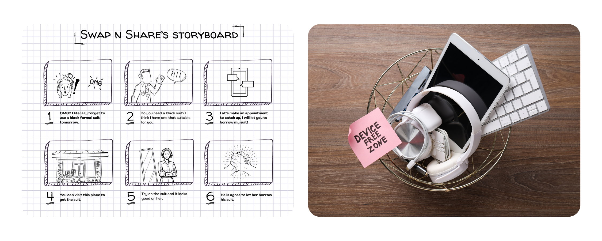

 
 <h2 align="center">Stay Tuned for The Subtle Reveal of Our New Logo</h2>
 
Get dynamically generated "Swap and Share" stats on very demure and very mindful!

    

  

 
 <h2 align="center">This is Our Teams</h2>
 
We’re the tech wizards with hearts of gold;

 
we’ve got the code and the compassion to make anything happen. 🧙‍♂️💻

 
Ketua Kelompok   : Rani Nirmala Prakoso    - 22/493982/TK/54153

 
Anggota 1        : Muhammad Luthfi Attaqi  - 22/496427/TK/54387

 
Anggota 2        : Varick Zahir Sarjiman   - 22/496418/TK/54384

# About Swap n Share 💖 #
"Swap n Share" merupakan aplikasi marketplace yang berfokus pada proses tukar-menukar dan pinjam-meminjam barang. Aplikasi ini menghubungkan user yang ingin menukar atau meminjam barang sehingga mengurangi pemborosan dengan memanfaatkan barang bekas yang sudah ada dan menciptakan suatu komunitas yang saling terkoneksi.

# Bubbly Backdrop 🌱 #
Aplikasi ini dibuat untuk memenuhi tugas praktikum Junior Project Departemen Teknik Elektro dan Teknologi Informasi Universitas Gadjah Mada tahun ajaran 2024/2025.

 
 <h1 align="center">Legit Problems 💬</h1>

1. Masalah pemborosan sumber daya (perilaku konsumtif)

   Konsumsi barang atau peralatan baru yang tinggi (perilaku konsumtif) dapat menyebabkan pemborosan sumber daya dan peningkatan limbah.
2. Pembuangan barang yang masih layak

   Seringnya terjadi pembuangan barang-barang yang masih layak pakai sehingga dapat menjadi peluang optimalisasi.
3. Keterbatasan Akses

   Terbatasnya akses materi maupun informasi seseorang akan memiliki suatu barang atau peralatan.

# Our Mindful Solutions 📫 #

Aplikasi desktop yang kami rancang merupakan aplikasi marketplace yang berfokus pada proses tukar-menukar dan pinjam-meminjam barang. Aplikasi ini menghubungkan user yang ingin menukar atau meminjam barang sehingga mengurangi pemborosan dengan memanfaatkan barang bekas yang sudah ada dan. menciptakan suatu komunitas yang saling terkoneksi.

# Features 💼 #
Coming soon! So, Stay tuned !!!

# Milestone 🚀 #

| Nama Kegiatan | Deskripsi Kegiatan | Tanggal|
|----|----|----|
| `konsep_aplikasi`| Mengidentifikasi kebutuhan pasar, target pengguna, dan masalah yang akan diselesaikan oleh aplikasi serta menentukan fitur-fitur utama yang akan disediakan oleh aplikasi | 19 Agustus 2024|
| `use_case_diagram`| Menggambarkan hubungan antara aktor dan use case dalam diagram untuk visualisasi | 26 Agustus 2024|
| `activity_diagram`| Menggambarkan urutan aktivitas yang terjadi, termasuk keputusan yang diambil, perulangan, dan aktivitas paralel| 26 Agustus 2024|
| `class_diagram`| Menentukan tipe data setiap atribut| 26 Agustus 2024|
| `UI_pada_welcoming_page`| Merancang tampilan dan tata letak halaman selamat datang agar ramah pengguna dan menarik| 29 Agustus 2024|

Developed with ❤️ in Indonesia (IDN)

