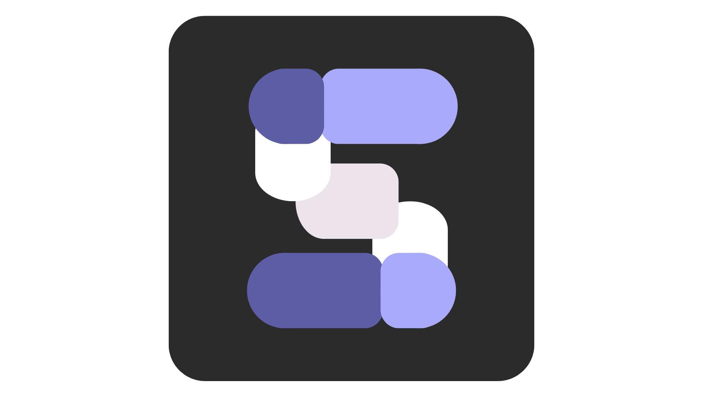
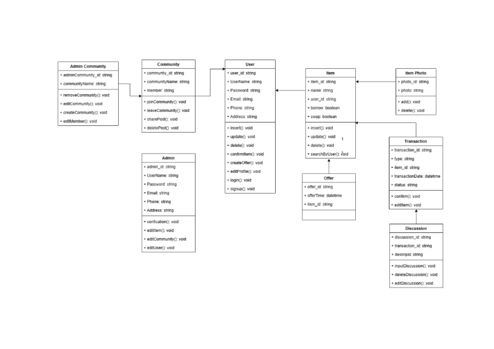

<p align="center">
 
 <h2 align="center">Stay Tuned for The Subtle Reveal of Our Application</h2>
 <p align="center">Get dynamically generated "Swap and Share" stats on very demure and very mindful!</p>
</p>
<p align="center">
    <a href="https://github.com/varick8/Swap-n-Share/graphs/contributors">
       
    </a>

<p align="center">
 
 <h2 align="center">This is Our Teams</h2>
 <p align="center">We’re the tech wizards with hearts of gold;</p>
 <p align="center">we’ve got the code and the compassion to make anything happen. 🧙‍♂️💻</p>
</p>

<p align="center">
 <p align="center">Ketua Kelompok   : Rani Nirmala Prakoso    - 22/493982/TK/54153</p>
 <p align="center">Anggota 1        : Muhammad Luthfi Attaqi  - 22/496427/TK/54387</p>
 <p align="center">Anggota 2        : Varick Zahir Sarjiman   - 22/496418/TK/54384</p>
</p>


# About Swap n Share 💖 #
"Swap n Share" merupakan aplikasi marketplace yang berfokus pada proses tukar-menukar dan pinjam-meminjam barang. Aplikasi ini menghubungkan user yang ingin menukar atau meminjam barang sehingga mengurangi pemborosan dengan memanfaatkan barang bekas yang sudah ada dan menciptakan suatu komunitas yang saling terkoneksi.

# Bubbly Backdrop 🌱 #
Aplikasi ini dibuat untuk memenuhi tugas praktikum Junior Project Departemen Teknik Elektro dan Teknologi Informasi Universitas Gadjah Mada tahun ajaran 2024/2025. Dapat dilihat pada [Presentasi](https://github.com/varick8/Swap-n-Share/blob/main/Swap-n-Share/documentation/PPT%20JUNPRO.pdf) berikut.

<p align="center">
 
 <h1 align="center">Legit Problems 💬</h1>
</p>

1. Masalah pemborosan sumber daya (perilaku konsumtif)

   Konsumsi barang atau peralatan baru yang tinggi (perilaku konsumtif) dapat menyebabkan pemborosan sumber daya dan peningkatan limbah.
2. Pembuangan barang yang masih layak

   Seringnya terjadi pembuangan barang-barang yang masih layak pakai sehingga dapat menjadi peluang optimalisasi.
3. Keterbatasan Akses

   Terbatasnya akses materi maupun informasi seseorang akan memiliki suatu barang atau peralatan.

# Our Mindful Solutions 📫 #

Aplikasi desktop yang kami rancang merupakan aplikasi marketplace yang berfokus pada proses tukar-menukar dan pinjam-meminjam barang. Aplikasi ini menghubungkan user yang ingin menukar atau meminjam barang sehingga mengurangi pemborosan dengan memanfaatkan barang bekas yang sudah ada dan. menciptakan suatu komunitas yang saling terkoneksi.

# Class Diagram #
Untuk membangun pondasi aplikasi ini, kami memutuskan untuk membuat class diagram. Class diagram ini berfungsi sebagai alur komunikasi antar komponen dimana dalam satu class diagram memuat objek (data yang memiliki masing-masing perilaku) sehingga akan memudahkan perihal alokasi memori. Perlu diketahui bahwa memori tidak akan dialokasikan ketika objek belum atau tidak berada dalam class.

<p align="center">
 
</p>

# Features 💼 #
1. Circular Economy News

   Pada HomePage akan tersedia berita yang diambil melalui API BBC yang dapat direct langsung ke [website](https://www.bbc.com/news/articles/cy87590pgm1o) terkait.
2. Swap Product

   Fitur yang menyediakan layanan untuk menukar barang yang Anda miliki dengan barang lain yang Anda butuhkan, dengan syarat kesepakatan bersama dengan pemilik barang yang ingin ditukar.
3. Share Product

   Fitur yang menyediakan layanan untuk meminjam barang yang Anda butuhkan, dengan syarat kesepakatan bersama dengan pemilik barang yang ingin dipinjam.
4. Community Groups

   Fitur yang menyediakan layanan grup chat sesuai dengan kategori barang yang disediakan, hal ini dibuat agar pengguna lebih mudah mendapatkan produk sesuai barang yang dibutuhkan untuk dipinjam ataupun di tukar

# How to Clone 💼 #
1. Install Visual Studio Code (17.11.6)
2. Clone Repositori
```
$ git clone https://github.com/varick8/Swap-n-Share.git
$ cd documentation
```
3. Install GunaUI
```
dotnet add package Guna.UI2.WinForms --version 2.0.4.6
```
4. Install NuGet Package
   

# How to Create Database 💼 #
1. Pastikan telah memiliki atau [install PostgreSQL](https://www.postgresql.org/download/)
2. Untuk menjalankan aplikasi Swap n Share setelah di clone, kita perlu menghubungkan antara file yang diclone dengan database lokal sehingga perlu membuat tabel database sesuai [panduan](https://github.com/varick8/Swap-n-Share/blob/main/Swap-n-Share/documentation/Testing%20and%20DB%20query.pdf)

# Milestone 🚀 #

| Nama Kegiatan | Deskripsi Kegiatan | Tanggal|
|----|----|----|
| `konsep_aplikasi`| Mengidentifikasi kebutuhan pasar, target pengguna, dan masalah yang akan diselesaikan oleh aplikasi serta menentukan fitur-fitur utama yang akan disediakan oleh aplikasi | 19 Agustus 2024|
| `use_case_diagram`| Menggambarkan hubungan antara aktor dan use case dalam diagram untuk visualisasi | 26 Agustus 2024|
| `activity_diagram`| Menggambarkan urutan aktivitas yang terjadi, termasuk keputusan yang diambil, perulangan, dan aktivitas paralel| 26 Agustus 2024|
| `class_diagram`| Menentukan tipe data setiap atribut| 26 Agustus 2024|
| `UI_pada_welcoming_page`| Merancang tampilan dan tata letak halaman selamat datang agar ramah pengguna dan menarik| 29 Agustus 2024|
| `class`| Membuat class dalam visual studio| 2 September 2024|
| `database`| Membuat integrasi awal database| 3 September 2024|
| `final_UI`| Membuat keseluruhan design UI aplikasi| 29 Oktober 2024|
| `create_azure`| Membuat integrasi database pada Azure for Student| 2 November 2024|
| `frontend`| Membuat tampilan aplikasi sesuai rancangan UI| 2 November 2024|
| `backend`| Membuat integrasi database dan frontend| 16 November 2024|
| `testing`| Melakukan testing pada semua fitur| 17 November 2024|
| `final_documentatio`| Membuat dokumentasi sebagai laporan akhir project| 2 September 2024|

<hr>
<p align="center">
Developed with ❤️ in Indonesia (IDN)
</p>
